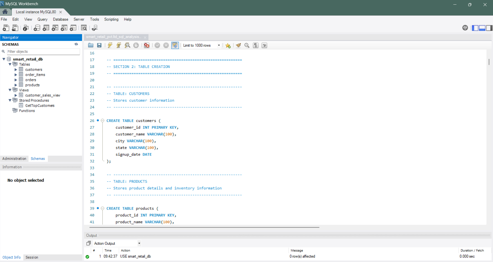
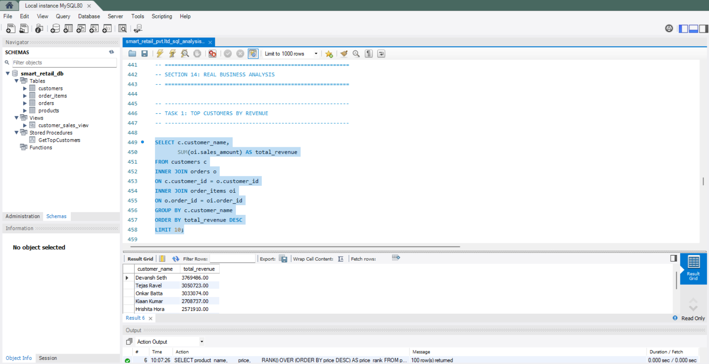
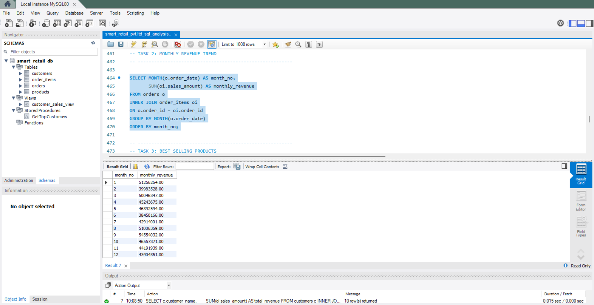
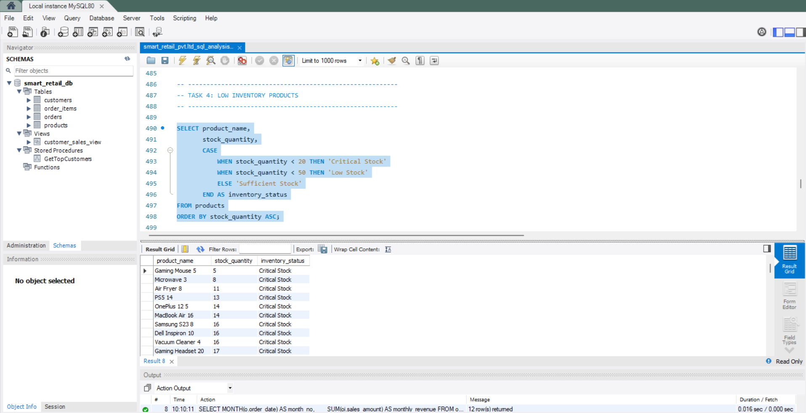
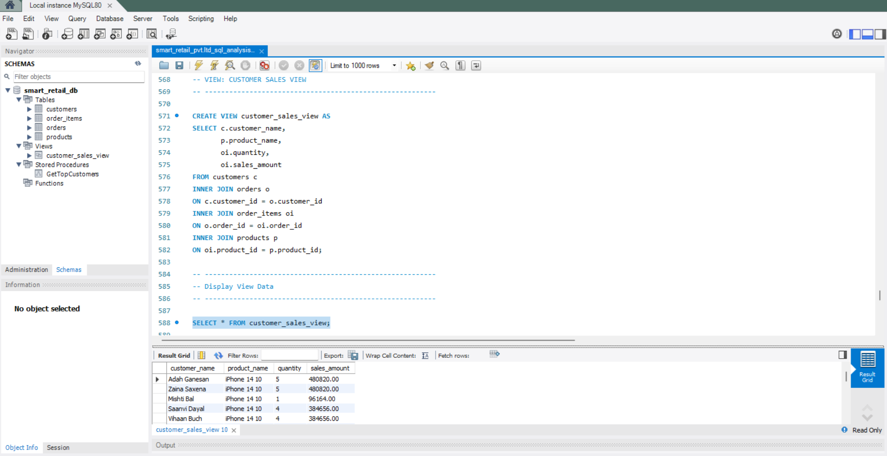
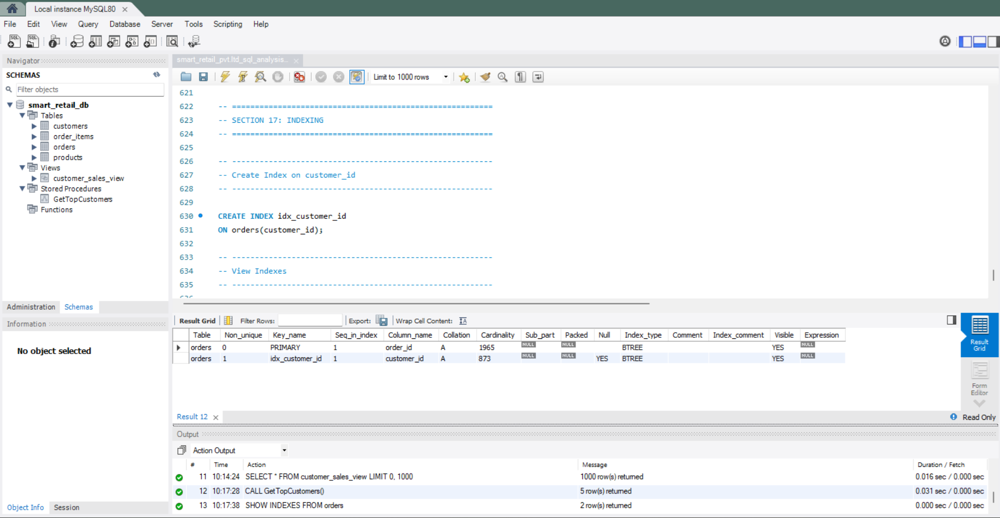
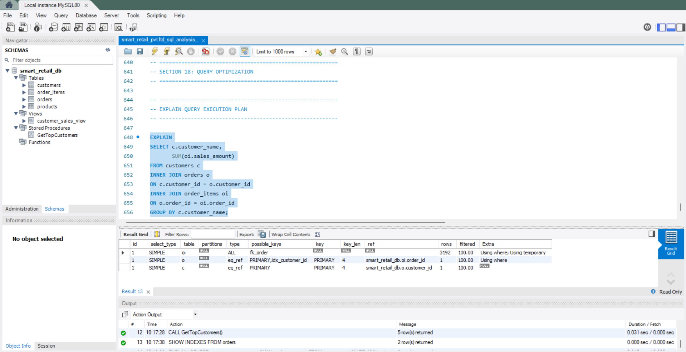

# Smart Retail Pvt. Ltd SQL Analysis Project

## 📌 Project Overview

This project is an end-to-end SQL Retail Analytics project designed to simulate real-world business scenarios for a retail company. The project focuses on database design, SQL development, business analysis, and performance optimization using MySQL.



The project includes:

* Database creation and table relationships
* Data import and validation
* SQL queries from basic to advanced level
* Business problem solving using SQL
* Views, Stored Procedures, and Indexing
* Real-world retail analytics insights

---

# 🛠️ Tools & Technologies Used

* MySQL
* MySQL Workbench
* SQL
* CSV Datasets
* GitHub

---

# 🗂️ Project Structure

```text
Smart-Retail-pvt.ltd-sql-analysis-project/
│
├── Dataset/
│   ├── customers.csv
│   ├── products.csv
│   ├── orders.csv
│   └── order_items.csv
│
├── SQL Queries/
│   └── smart_retail_analysis.sql
│
├── Screenshots/
│
├── README.md
│
└── Project_Report.pdf
```

---

# 🏢 Business Problem

Smart Retail Pvt. Ltd wanted to analyze customer purchases, product performance, inventory status, payment trends, and revenue growth using SQL-based analytics.

The objective was to:

* Improve business decision making
* Identify high-value customers
* Analyze revenue trends
* Track best-selling products
* Detect low inventory products
* Segment customers based on spending

---

# 🧱 Database Design

The database contains 4 tables:

| Table Name  | Description                             |
| ----------- | --------------------------------------- |
| customers   | Stores customer information             |
| products    | Stores product and inventory details    |
| orders      | Stores order-level details              |
| order_items | Stores product-level order transactions |

---

# 🔗 Database Relationships

* One customer can place multiple orders
* One order can contain multiple products
* Products are linked using order_items table

Foreign Keys Used:

* customer_id
* order_id
* product_id

---

# 📊 SQL Concepts Covered

## ✅ Basic SQL

* SELECT
* WHERE
* ORDER BY
* LIMIT

## ✅ Aggregate Functions

* COUNT()
* SUM()
* AVG()
* MAX()
* MIN()

## ✅ GROUP BY & HAVING

* Product category analysis
* Revenue calculations

## ✅ SQL JOINS

* INNER JOIN
* LEFT JOIN
* Multi-table joins

## ✅ Advanced SQL

* CASE WHEN
* Subqueries
* CTEs
* Window Functions
* RANK()
* LAG()
* Running Totals

## ✅ SQL Developer Concepts

* Views
* Stored Procedures
* Indexing
* Query Optimization
* EXPLAIN

---

# 📈 Business Analysis Tasks Performed

## 1. Top Customers by Revenue

Identified highest spending customers using aggregate analysis.



## 2. Monthly Revenue Trend

Analyzed month-wise business performance.



## 3. Low Inventory Products

Detected products requiring restocking.



## 4. Best Selling Products

Tracked products with highest sales quantity and revenue.

## 5. Payment Method Analysis

Analyzed customer payment preferences.

## 6. Repeat Customers

Identified returning customers for retention analysis.

## 7. Customer Segmentation

Segmented customers into:

* VIP
* Regular
* Low Value

## 8. Month-over-Month Growth

Analyzed business growth using window functions.

---

# 🚀 Advanced SQL Features Implemented

## 🔹 Views

Created reusable SQL view:

* customer_sales_view



## 🔹 Indexing

Implemented indexing on:

* customer_id



## 🔹 Query Optimization

Used EXPLAIN statement to analyze query execution plans.



---

# 🎯 Key Skills Demonstrated

* SQL Development
* Relational Database Design
* Business Analysis
* Data Analysis
* Data Cleaning
* Query Optimization
* Analytical Thinking
* Reporting & Insights

---

# 💡 Project Highlights

* Designed normalized retail database
* Built advanced SQL queries for business insights
* Performed customer segmentation and revenue analysis
* Implemented views, procedures, and indexing
* Solved real-world retail business problems using SQL

---

# 📌 Learning Outcomes

Through this project, the following concepts were learned:

* Database architecture
* SQL query writing
* Advanced analytical SQL
* Retail business analytics
* SQL performance optimization
* Real-world data analysis workflows

---

# 👨‍💻 Author

Sneh Parekh

* GitHub: [https://github.com/Sneh-parekh](https://github.com/Sneh-parekh)
* LinkedIn: [https://www.linkedin.com/in/sneh-parekh03/](https://www.linkedin.com/in/sneh-parekh06)

---

# ⭐ Conclusion

This project demonstrates practical SQL development and business analytics skills using a real-world retail database scenario. The project showcases the ability to design databases, analyze business data, optimize queries, and generate actionable insights using SQL.
